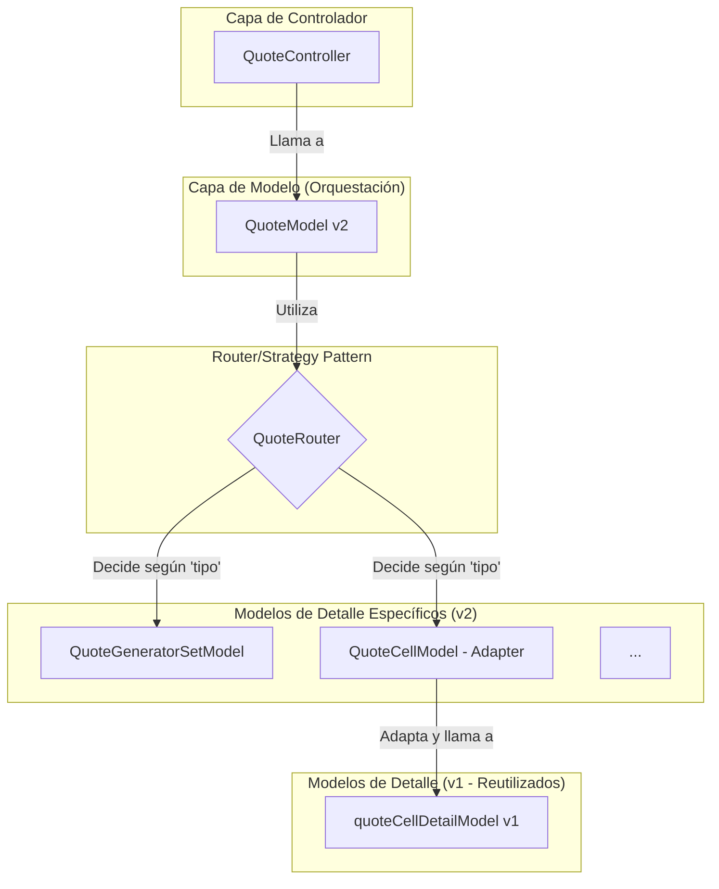

# Análisis del Modelo de Datos de Cotizaciones (v1 vs. v2)

Este documento describe la estructura de datos para las cotizaciones y sus detalles, comparando la implementación original (v1) con la nueva versión (v2).

---

## Modelo v1: Estructura Monolítica

El modelo v1 se caracteriza por una estructura más centralizada y dependiente de procedimientos almacenados que contienen gran parte de la lógica de negocio.

### 1. Cabecera de la Cotización (`quoteModel.js`)

La entidad principal de la cotización almacena una gran cantidad de campos directamente.

- **Propiedades Principales:**
  - `Cotizacon_Id`: Identificador único.
  - `cliente_id`, `ejecutivo_id`: IDs de cliente y vendedor.
  - `fecha`, `validez_oferta`: Fechas relevantes.
  - `proyecto`, `direccion`, `contacto`: Información del proyecto y contacto.
  - `moneda_id`, `tipo_cambio`: Detalles de la moneda.
  - `condicion_comercial_id`, `canal_distribucion_id`, `incoterm_id`: IDs de condiciones comerciales.
  - `estado`: Estado actual de la cotización (ej. Pendiente, Aprobada).
  - `observaciones`, `observaciones_HTML`: Notas y comentarios.
  - `descuento_global`, `margen_global`: Campos para cálculos globales.

### 2. Detalles de la Cotización (`quoteDetailsModel.js`)

Los detalles (items) de la cotización se manejan en un modelo separado, pero la lógica para los diferentes tipos de productos está mezclada.

- **Relación:** Una cotización (`cotizacion`) tiene muchos detalles (`cotizaciondetalle`).
- **Lógica de Tipos:** Se utiliza un campo `tipo` (1: GE, 2: Cables, 3: Celdas, 4: Transformadores) para determinar qué lógica aplicar a través de un `switch`.
- **Información por Detalle:**
  - Cada detalle tiene campos básicos como `cantidad`, `precio_unitario`, `producto_id`.
  - La información específica de cada tipo de producto (ej. motor, alternador para un GE) se guarda en tablas adicionales (`cotizaciondetalleextra`, `cotizaciondetallege`, etc.) y se une en tiempo de ejecución.
  - **GE (`tipo: 1`):** Guarda IDs de `Motor_Id`, `Alternador_Id`, `nITMId`, y parámetros como altura y temperatura. Los accesorios se guardan en `compadicionaldetalle`.
  - **Celdas, Cables, Transformadores (`tipo: 2, 3, 4`):** La información específica se almacena en tablas como `cotizaciondetalle_cable`, `cotizaciondetalle_celda`, etc.

---

## Modelo v2: Enfoque Modular y Orientado a Objetos

La v2 refactoriza el modelo de datos hacia un enfoque más modular y desacoplado, utilizando un patrón Strategy o Factory para manejar los diferentes tipos de detalles.

### 1. Cabecera de la Cotización (`v2/quote/QuoteModel.js`)

La estructura de la cabecera es similar a la v1, ya que reutiliza el mismo procedimiento almacenado (`cot_crear`). Sin embargo, la lógica de orquestación cambia.

- **Orquestación:** El `QuoteModel` de la v2 actúa como un orquestador. Llama al `QuoteRouter` para delegar la creación y actualización de los detalles al modelo específico del producto.

### 2. Detalles de la Cotización (Estructura Modular)

La principal diferencia radica en cómo se manejan los detalles.

- **`QuoteRouter.js`:** Este nuevo componente es clave. En función del `cotizador_tipo` de la cotización, decide qué modelo de detalle debe instanciar y utilizar.
- **Modelos de Detalle Específicos:**
  - **`generator_sets/QuoteGeneratorSetModel.js`:**
    - Contiene toda la lógica para crear y actualizar un detalle de tipo "Grupo Electrógeno".
    - Recibe un objeto `detail` mucho más estructurado y complejo, con propiedades anidadas como `operativeCosts`, `configuration`, y `accessories`.
    - **Mapeo de Datos:** Utiliza un `QuoteGeneratorSetDatabaseMapper` para transformar el objeto `detail` del frontend a los múltiples parámetros que requiere el procedimiento almacenado `cotizaciondetallege_crear`. Esto aísla la lógica de mapeo de la lógica de negocio.
  - **`cells/QuoteCellModel.js`:**
    - Este modelo, en su estado actual, actúa como un **Adaptador**. Reutiliza la lógica del modelo de la v1 (`quoteCellDetailModel.js`) para mantener la compatibilidad mientras se migra el sistema. Esto demuestra una estrategia de refactorización incremental.
- **Relaciones:** La relación fundamental (una cotización tiene muchos detalles) se mantiene, pero la implementación de la lógica de negocio para cada tipo de detalle está ahora encapsulada en su propia clase/módulo, lo que mejora la cohesión y reduce el acoplamiento.

---

## Diagrama de Flujo del Modelo v2

El siguiente diagrama ilustra el flujo de control y la relación entre los componentes del modelo de datos en la v2 al crear o actualizar un detalle de cotización.

